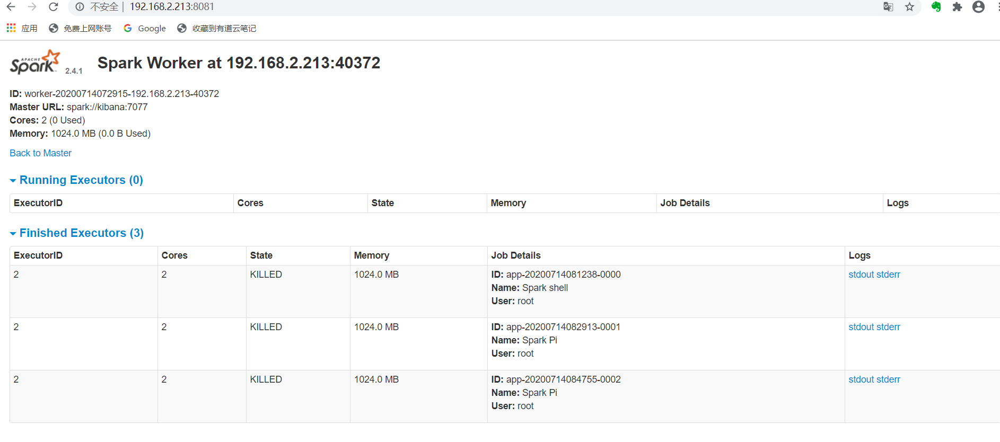

[Licensed under the CC BY-NC-SA 4.0](https://creativecommons.org/licenses/by-nc-sa/4.0/deed.zh)

在此感谢 [@spark](https://spark.apache.org/) 

文档不定时更新，如有疑问请及时联系本文作者，当前文档版本1.0.0

[spark-2.4.1-bin-hadoop2.7.tgz](http://archive.apache.org/dist/spark/spark-2.4.1/) 

 

| IP            | HOSTNAME   | COMPONENTS    |
| ------------- | ---------- | ------------- |
| 192.168.2.15  | kibana     | Master,Worker |
| 192.168.2.184 | docker     | Master,Worker |
| 192.168.2.213 | kubernetes | Worker        |

###### 1: zookeeper

请参考 [4.3.1.zookeeper-3.5.5.md](../../4.middleware/4.3.zookeeper/4.3.1.zookeeper-3.5.5.md) 

###### 2: spark

~~~
[root@kibana opt]# tar zxf spark-2.4.1-bin-hadoop2.7.tgz
[root@kibana opt]# cd /opt/spark-2.4.1-bin-hadoop2.7/conf
[root@kibana conf]# cp spark-env.sh.template spark-env.sh
[root@kibana conf]# cp spark-defaults.conf.template spark-defaults.conf
[root@kibana conf]# cp slaves.template slaves
[root@kibana conf]# vi spark-env.sh
JAVA_HOME=/usr/java/jdk1.8.0_221
# SPARK_MASTER_HOST
SPARK_MASTER_PORT=7077
# SPARK_MASTER_WEBUI_PORT 默认8080
SPARK_MASTER_WEBUI_PORT=28080
SPARK_WORKER_MEMORY=1g
# SPARK_WORKER_PORT 默认随机值 SPARK_WORKER_WEBUI_PORT 默认8081
# SPARK_WORKER_PORT / SPARK_WORKER_WEBUI_PORT
SPARK_WORKER_DIR=/home/datas/spark/worker
# 用zookeeper做高可用
SPARK_DAEMON_JAVA_OPTS="-Dspark.deploy.recoveryMode=ZOOKEEPER -Dspark.deploy.zookeeper.url=192.168.2.15:2181,192.168.2.184:2181,192.168.2.213:2181 -Dspark.deploy.zookeeper.dir=/spark"
SPARK_LOG_DIR=/home/logs/spark
[root@kibana conf]# 
[root@kibana conf]# vi spark-defaults.conf
spark.master                     spark://192.168.2.15:7077,192.168.2.184:7077
spark.serializer                 org.apache.spark.serializer.KryoSerializer
spark.driver.memory              1g

# 处理RDD时每个stage的task数量
spark.default.parallelism	     10
# spark sql分区数
spark.sql.shuffle.partitions 	 10

# 向下兼容
spark.executor.extraClassPath   /opt/spark-2.4.1-bin-hadoop2.7/lib/*
spark.driver.extraClassPath     /opt/spark-2.4.1-bin-hadoop2.7/lib/*
[root@kibana conf]# vi slaves
192.168.2.15
192.168.2.184
192.168.2.213

# 启动全部(slave依赖slaves文件)
[root@kibana conf]# /opt/spark-2.4.1-bin-hadoop2.7/sbin/start-all.sh
# 启动宿主机master
[root@kibana conf]# /opt/spark-2.4.1-bin-hadoop2.7/sbin/start-master.sh
# 启动宿主机slave
[root@kibana conf]# /opt/spark-2.4.1-bin-hadoop2.7/sbin/start-slave.sh
# 启动所有slave(依赖slaves文件)
[root@kibana conf]# /opt/spark-2.4.1-bin-hadoop2.7/sbin/start-slaves.sh
[root@kibana conf]#
~~~

~~~
[root@kubernetes opt]# /opt/spark-2.4.1-bin-hadoop2.7/bin/spark-shell --master spark://kibana:7077
20/07/14 08:12:30 WARN NativeCodeLoader: Unable to load native-hadoop library for your platform... using builtin-java classes where applicable
Using Spark's default log4j profile: org/apache/spark/log4j-defaults.properties
Setting default log level to "WARN".
To adjust logging level use sc.setLogLevel(newLevel). For SparkR, use setLogLevel(newLevel).
Spark context Web UI available at http://kubernetes:4040
Spark context available as 'sc' (master = spark://kibana:7077, app id = app-20200714081238-0000).
Spark session available as 'spark'.
Welcome to
      ____              __
     / __/__  ___ _____/ /__
    _\ \/ _ \/ _ `/ __/  '_/
   /___/ .__/\_,_/_/ /_/\_\   version 2.4.1
      /_/
         
Using Scala version 2.11.12 (Java HotSpot(TM) 64-Bit Server VM, Java 1.8.0_221)
Type in expressions to have them evaluated.
Type :help for more information.

scala> [root@kubernetes opt]# 
[root@kubernetes opt]# 
[root@kubernetes opt]# 
[root@kubernetes opt]# /opt/spark-2.4.1-bin-hadoop2.7/bin/run-example SparkPi 10
20/07/14 08:47:55 WARN NativeCodeLoader: Unable to load native-hadoop library for your platform... using builtin-java classes where applicable
Using Spark's default log4j profile: org/apache/spark/log4j-defaults.properties
20/07/14 08:47:55 INFO SparkContext: Running Spark version 2.4.1
20/07/14 08:47:55 INFO SparkContext: Submitted application: Spark Pi
20/07/14 08:47:55 INFO SecurityManager: Changing view acls to: root
20/07/14 08:47:55 INFO SecurityManager: Changing modify acls to: root
20/07/14 08:47:55 INFO SecurityManager: Changing view acls groups to: 
20/07/14 08:47:55 INFO SecurityManager: Changing modify acls groups to: 
20/07/14 08:47:55 INFO SecurityManager: SecurityManager: authentication disabled; ui acls disabled; users  with view permissions: Set(root); groups with view permissions: Set(); users  with modify permissions: Set(root); groups with modify permissions: Set()
20/07/14 08:47:56 INFO Utils: Successfully started service 'sparkDriver' on port 40062.
20/07/14 08:47:56 INFO SparkEnv: Registering MapOutputTracker
20/07/14 08:47:56 INFO SparkEnv: Registering BlockManagerMaster
20/07/14 08:47:56 INFO BlockManagerMasterEndpoint: Using org.apache.spark.storage.DefaultTopologyMapper for getting topology information
20/07/14 08:47:56 INFO BlockManagerMasterEndpoint: BlockManagerMasterEndpoint up
20/07/14 08:47:56 INFO DiskBlockManager: Created local directory at /tmp/blockmgr-c20ce5f5-0fea-449b-9d30-f2be76d717a2
20/07/14 08:47:56 INFO MemoryStore: MemoryStore started with capacity 366.3 MB
20/07/14 08:47:56 INFO SparkEnv: Registering OutputCommitCoordinator
20/07/14 08:47:56 INFO Utils: Successfully started service 'SparkUI' on port 4040.
20/07/14 08:47:56 INFO SparkUI: Bound SparkUI to 0.0.0.0, and started at http://kubernetes:4040
20/07/14 08:47:56 INFO SparkContext: Added JAR file:///opt/spark-2.4.1-bin-hadoop2.7/examples/jars/spark-examples_2.11-2.4.1.jar at spark://kubernetes:40062/jars/spark-examples_2.11-2.4.1.jar with timestamp 1594687676682
20/07/14 08:47:56 INFO SparkContext: Added JAR file:///opt/spark-2.4.1-bin-hadoop2.7/examples/jars/scopt_2.11-3.7.0.jar at spark://kubernetes:40062/jars/scopt_2.11-3.7.0.jar with timestamp 1594687676682
20/07/14 08:47:56 INFO StandaloneAppClient$ClientEndpoint: Connecting to master spark://192.168.2.15:7077...
20/07/14 08:47:56 INFO StandaloneAppClient$ClientEndpoint: Connecting to master spark://192.168.2.184:7077...
20/07/14 08:47:56 INFO TransportClientFactory: Successfully created connection to /192.168.2.184:7077 after 36 ms (0 ms spent in bootstraps)
20/07/14 08:47:56 INFO TransportClientFactory: Successfully created connection to /192.168.2.15:7077 after 46 ms (0 ms spent in bootstraps)
20/07/14 08:47:57 INFO StandaloneSchedulerBackend: Connected to Spark cluster with app ID app-20200714084755-0002
20/07/14 08:47:57 INFO StandaloneAppClient$ClientEndpoint: Executor added: app-20200714084755-0002/0 on worker-20200714072903-192.168.2.15-35543 (192.168.2.15:35543) with 2 core(s)
20/07/14 08:47:57 INFO StandaloneSchedulerBackend: Granted executor ID app-20200714084755-0002/0 on hostPort 192.168.2.15:35543 with 2 core(s), 1024.0 MB RAM
20/07/14 08:47:57 INFO StandaloneAppClient$ClientEndpoint: Executor added: app-20200714084755-0002/1 on worker-20200714072909-192.168.2.184-38961 (192.168.2.184:38961) with 2 core(s)
20/07/14 08:47:57 INFO StandaloneSchedulerBackend: Granted executor ID app-20200714084755-0002/1 on hostPort 192.168.2.184:38961 with 2 core(s), 1024.0 MB RAM
20/07/14 08:47:57 INFO StandaloneAppClient$ClientEndpoint: Executor added: app-20200714084755-0002/2 on worker-20200714072915-192.168.2.213-40372 (192.168.2.213:40372) with 2 core(s)
20/07/14 08:47:57 INFO StandaloneSchedulerBackend: Granted executor ID app-20200714084755-0002/2 on hostPort 192.168.2.213:40372 with 2 core(s), 1024.0 MB RAM
20/07/14 08:47:57 INFO StandaloneAppClient$ClientEndpoint: Executor updated: app-20200714084755-0002/2 is now RUNNING
20/07/14 08:47:57 INFO Utils: Successfully started service 'org.apache.spark.network.netty.NettyBlockTransferService' on port 45632.
20/07/14 08:47:57 INFO NettyBlockTransferService: Server created on kubernetes:45632
20/07/14 08:47:57 INFO BlockManager: Using org.apache.spark.storage.RandomBlockReplicationPolicy for block replication policy
20/07/14 08:47:57 INFO StandaloneAppClient$ClientEndpoint: Executor updated: app-20200714084755-0002/0 is now RUNNING
20/07/14 08:47:57 INFO StandaloneAppClient$ClientEndpoint: Executor updated: app-20200714084755-0002/1 is now RUNNING
20/07/14 08:47:57 INFO BlockManagerMaster: Registering BlockManager BlockManagerId(driver, kubernetes, 45632, None)
20/07/14 08:47:57 INFO BlockManagerMasterEndpoint: Registering block manager kubernetes:45632 with 366.3 MB RAM, BlockManagerId(driver, kubernetes, 45632, None)
20/07/14 08:47:57 INFO BlockManagerMaster: Registered BlockManager BlockManagerId(driver, kubernetes, 45632, None)
20/07/14 08:47:57 INFO BlockManager: Initialized BlockManager: BlockManagerId(driver, kubernetes, 45632, None)
20/07/14 08:47:57 INFO StandaloneSchedulerBackend: SchedulerBackend is ready for scheduling beginning after reached minRegisteredResourcesRatio: 0.0
20/07/14 08:47:58 INFO SparkContext: Starting job: reduce at SparkPi.scala:38
20/07/14 08:47:58 INFO DAGScheduler: Got job 0 (reduce at SparkPi.scala:38) with 10 output partitions
20/07/14 08:47:58 INFO DAGScheduler: Final stage: ResultStage 0 (reduce at SparkPi.scala:38)
20/07/14 08:47:58 INFO DAGScheduler: Parents of final stage: List()
20/07/14 08:47:58 INFO DAGScheduler: Missing parents: List()
20/07/14 08:47:58 INFO DAGScheduler: Submitting ResultStage 0 (MapPartitionsRDD[1] at map at SparkPi.scala:34), which has no missing parents
20/07/14 08:47:58 INFO MemoryStore: Block broadcast_0 stored as values in memory (estimated size 1936.0 B, free 366.3 MB)
20/07/14 08:47:59 INFO MemoryStore: Block broadcast_0_piece0 stored as bytes in memory (estimated size 1232.0 B, free 366.3 MB)
20/07/14 08:47:59 INFO BlockManagerInfo: Added broadcast_0_piece0 in memory on kubernetes:45632 (size: 1232.0 B, free: 366.3 MB)
20/07/14 08:47:59 INFO SparkContext: Created broadcast 0 from broadcast at DAGScheduler.scala:1161
20/07/14 08:47:59 INFO DAGScheduler: Submitting 10 missing tasks from ResultStage 0 (MapPartitionsRDD[1] at map at SparkPi.scala:34) (first 15 tasks are for partitions Vector(0, 1, 2, 3, 4, 5, 6, 7, 8, 9))
20/07/14 08:47:59 INFO TaskSchedulerImpl: Adding task set 0.0 with 10 tasks
20/07/14 08:47:59 INFO CoarseGrainedSchedulerBackend$DriverEndpoint: Registered executor NettyRpcEndpointRef(spark-client://Executor) (192.168.2.15:47900) with ID 0
20/07/14 08:47:59 INFO TaskSetManager: Starting task 0.0 in stage 0.0 (TID 0, 192.168.2.15, executor 0, partition 0, PROCESS_LOCAL, 7734 bytes)
20/07/14 08:47:59 INFO TaskSetManager: Starting task 1.0 in stage 0.0 (TID 1, 192.168.2.15, executor 0, partition 1, PROCESS_LOCAL, 7736 bytes)
20/07/14 08:47:59 INFO CoarseGrainedSchedulerBackend$DriverEndpoint: Registered executor NettyRpcEndpointRef(spark-client://Executor) (192.168.2.184:44590) with ID 1
20/07/14 08:47:59 INFO TaskSetManager: Starting task 2.0 in stage 0.0 (TID 2, 192.168.2.184, executor 1, partition 2, PROCESS_LOCAL, 7736 bytes)
20/07/14 08:47:59 INFO TaskSetManager: Starting task 3.0 in stage 0.0 (TID 3, 192.168.2.184, executor 1, partition 3, PROCESS_LOCAL, 7736 bytes)
20/07/14 08:47:59 INFO BlockManagerMasterEndpoint: Registering block manager 192.168.2.15:44900 with 366.3 MB RAM, BlockManagerId(0, 192.168.2.15, 44900, None)
20/07/14 08:47:59 INFO BlockManagerMasterEndpoint: Registering block manager 192.168.2.184:44475 with 366.3 MB RAM, BlockManagerId(1, 192.168.2.184, 44475, None)
20/07/14 08:48:00 INFO CoarseGrainedSchedulerBackend$DriverEndpoint: Registered executor NettyRpcEndpointRef(spark-client://Executor) (192.168.2.213:56020) with ID 2
20/07/14 08:48:00 INFO TaskSetManager: Starting task 4.0 in stage 0.0 (TID 4, 192.168.2.213, executor 2, partition 4, PROCESS_LOCAL, 7736 bytes)
20/07/14 08:48:00 INFO TaskSetManager: Starting task 5.0 in stage 0.0 (TID 5, 192.168.2.213, executor 2, partition 5, PROCESS_LOCAL, 7736 bytes)
20/07/14 08:48:00 INFO BlockManagerInfo: Added broadcast_0_piece0 in memory on 192.168.2.15:44900 (size: 1232.0 B, free: 366.3 MB)
20/07/14 08:48:00 INFO BlockManagerInfo: Added broadcast_0_piece0 in memory on 192.168.2.184:44475 (size: 1232.0 B, free: 366.3 MB)
20/07/14 08:48:00 INFO BlockManagerMasterEndpoint: Registering block manager 192.168.2.213:38299 with 366.3 MB RAM, BlockManagerId(2, 192.168.2.213, 38299, None)
20/07/14 08:48:01 INFO TaskSetManager: Starting task 6.0 in stage 0.0 (TID 6, 192.168.2.15, executor 0, partition 6, PROCESS_LOCAL, 7736 bytes)
20/07/14 08:48:01 INFO TaskSetManager: Starting task 7.0 in stage 0.0 (TID 7, 192.168.2.15, executor 0, partition 7, PROCESS_LOCAL, 7736 bytes)
20/07/14 08:48:01 INFO TaskSetManager: Starting task 8.0 in stage 0.0 (TID 8, 192.168.2.184, executor 1, partition 8, PROCESS_LOCAL, 7736 bytes)
20/07/14 08:48:01 INFO TaskSetManager: Starting task 9.0 in stage 0.0 (TID 9, 192.168.2.184, executor 1, partition 9, PROCESS_LOCAL, 7736 bytes)
20/07/14 08:48:01 INFO TaskSetManager: Finished task 3.0 in stage 0.0 (TID 3) in 1425 ms on 192.168.2.184 (executor 1) (1/10)
20/07/14 08:48:01 INFO TaskSetManager: Finished task 6.0 in stage 0.0 (TID 6) in 117 ms on 192.168.2.15 (executor 0) (2/10)
20/07/14 08:48:01 INFO TaskSetManager: Finished task 2.0 in stage 0.0 (TID 2) in 1472 ms on 192.168.2.184 (executor 1) (3/10)
20/07/14 08:48:01 INFO TaskSetManager: Finished task 7.0 in stage 0.0 (TID 7) in 117 ms on 192.168.2.15 (executor 0) (4/10)
20/07/14 08:48:01 INFO TaskSetManager: Finished task 0.0 in stage 0.0 (TID 0) in 1571 ms on 192.168.2.15 (executor 0) (5/10)
20/07/14 08:48:01 INFO TaskSetManager: Finished task 1.0 in stage 0.0 (TID 1) in 1515 ms on 192.168.2.15 (executor 0) (6/10)
20/07/14 08:48:01 INFO TaskSetManager: Finished task 9.0 in stage 0.0 (TID 9) in 103 ms on 192.168.2.184 (executor 1) (7/10)
20/07/14 08:48:01 INFO TaskSetManager: Finished task 8.0 in stage 0.0 (TID 8) in 124 ms on 192.168.2.184 (executor 1) (8/10)
20/07/14 08:48:01 INFO BlockManagerInfo: Added broadcast_0_piece0 in memory on 192.168.2.213:38299 (size: 1232.0 B, free: 366.3 MB)
20/07/14 08:48:02 INFO TaskSetManager: Finished task 4.0 in stage 0.0 (TID 4) in 1469 ms on 192.168.2.213 (executor 2) (9/10)
20/07/14 08:48:02 INFO TaskSetManager: Finished task 5.0 in stage 0.0 (TID 5) in 1457 ms on 192.168.2.213 (executor 2) (10/10)
20/07/14 08:48:02 INFO DAGScheduler: ResultStage 0 (reduce at SparkPi.scala:38) finished in 3.692 s
20/07/14 08:48:02 INFO TaskSchedulerImpl: Removed TaskSet 0.0, whose tasks have all completed, from pool 
20/07/14 08:48:02 INFO DAGScheduler: Job 0 finished: reduce at SparkPi.scala:38, took 3.845752 s
Pi is roughly 3.1432911432911435
20/07/14 08:48:02 INFO SparkUI: Stopped Spark web UI at http://kubernetes:4040
20/07/14 08:48:02 INFO StandaloneSchedulerBackend: Shutting down all executors
20/07/14 08:48:02 INFO CoarseGrainedSchedulerBackend$DriverEndpoint: Asking each executor to shut down
20/07/14 08:48:02 INFO MapOutputTrackerMasterEndpoint: MapOutputTrackerMasterEndpoint stopped!
20/07/14 08:48:02 INFO MemoryStore: MemoryStore cleared
20/07/14 08:48:02 INFO BlockManager: BlockManager stopped
20/07/14 08:48:02 INFO BlockManagerMaster: BlockManagerMaster stopped
20/07/14 08:48:02 INFO OutputCommitCoordinator$OutputCommitCoordinatorEndpoint: OutputCommitCoordinator stopped!
20/07/14 08:48:02 INFO SparkContext: Successfully stopped SparkContext
20/07/14 08:48:02 INFO ShutdownHookManager: Shutdown hook called
20/07/14 08:48:02 INFO ShutdownHookManager: Deleting directory /tmp/spark-2c1e9b67-5267-45a6-b274-d9c8d121f2e8
20/07/14 08:48:02 INFO ShutdownHookManager: Deleting directory /tmp/spark-36975714-a125-4c03-9bb8-d34b3ca7b4ea
[root@kubernetes opt]#
~~~

 

  

 